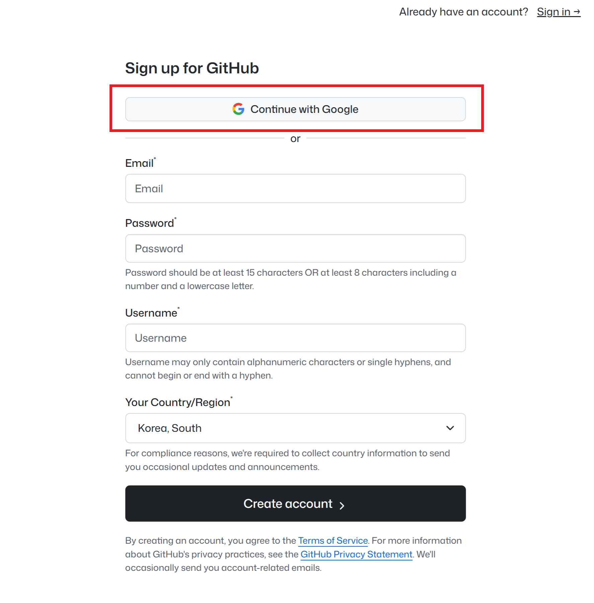
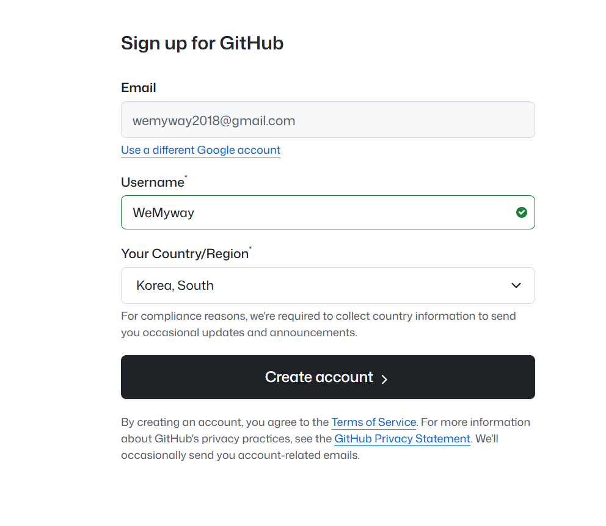
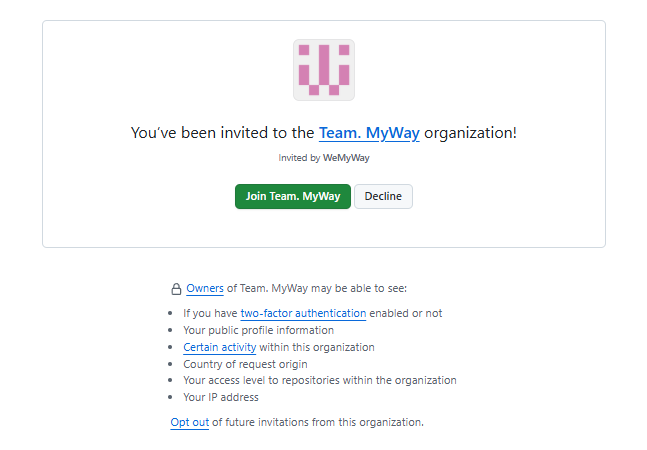

# 깃허브 가입 가이드

## 1. github.com 접속
## 2. 오른쪽 위에 Signup 클릭

## 3. 구글 계정으로 시작하기 누르고 로그인

## 4. 닉네임 설정 후 계정만들기

## 생성완료. 이제 이메일알려주세요
## 이메일 보냈다고 하면 다음과 같이 메일이 옴

## 초록색깔 누르세요

## 초록색 한번더 누르고 이런 내용이 뜨면 성공

